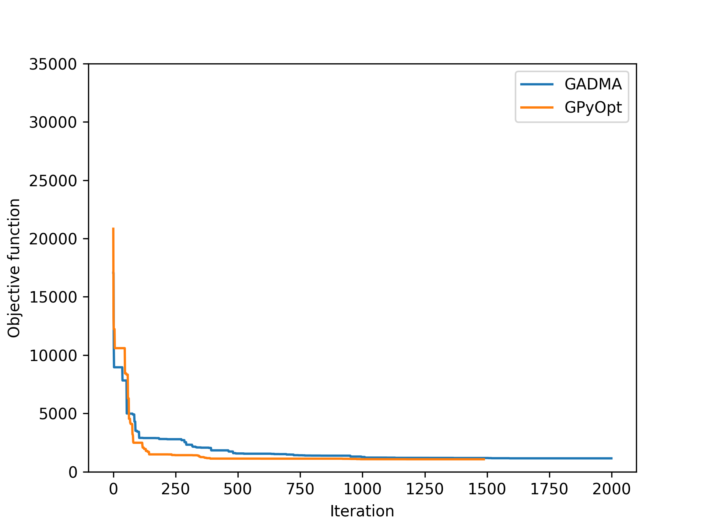

# Final Project

*Bioinformatics Institute, 2019*

*Ilia Sheshukov*

## Project goals

The project goal was to replace a [BFGS optimization algorithm](https://en.wikipedia.org/wiki/Broyden%E2%80%93Fletcher%E2%80%93Goldfarb%E2%80%93Shanno_algorithm) used in the tool [moments](https://bitbucket.org/simongravel/moments) with the Bayesian optimization algorithm and to study the effects. 

## Methods

We used `GPyOpt` library for the algorithm, then we took the optimization routine in `moments` and replaced the algorithm.

## Requirements

Python >= 2.5

(Tested on Ubuntu 19.04, Python 2.7.15)

## How to run

### Dependencies

*It's best to use isolated environments like virtualenv or conda.*

Install [moments](https://bitbucket.org/simongravel/moments) according to the instructions, then execute

```
pip install -r requirements.txt
```

to install dependencies.

### Running

Run `python2 2pop_6.py`, `python2 2pop_8.py` or `python2 3pop_13.py`.

There are no parameters to set in CLI. You can change the program by editing the source code.

## Results

After the successful run of the one of the aforementioned scripts you'll see the results in `out` folder. They are in the form of csv table `log.txt`, `GPyOpt` reports and `GPyOpt` plots provided that your problem is 1- or 2-dimensional.

From the log file convergence plot may be constructed, for example


