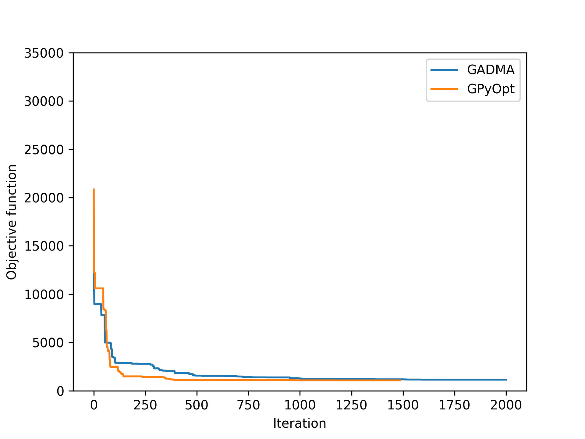

---
title: Байесовская оптимизации для вывода демографических историй
author: Илья Шешуков
header-includes:
- \usepackage{xcolor} 
- \usepackage{xspace} 
- \newcommand{\dadi}{∂a∂i\ }
- \usepackage{unicode-math}
- \usepackage{booktabs}
fonttheme: professionalfonts
theme: metropolis
themeoptions: [subsectionpage=simple, numbering=fraction, progressbar=frametitle, block=fill]
...

# Введение {.standout}

## Демографическая модель популяции

Имея геномы людей, хотим понять как изменялись их популяции. Как
менялась численность, когда популяции разделялись, как сильно они
мигрировали.

{ height=40% .center}

## Аллель-частотный спектр {#аллель-частотный-спектр-1 beamer_env="definition"}

Аллель-частотный спектр это распределение частоты аллелей в данных
локусах в популяции или выборке.

{ width=50% .center}

<!---
## Пример

          SNP 1   SNP 2   SNP 3   SNP 4   SNP 5   SNP 6   SNP 7   SNP 8
  ------- ------- ------- ------- ------- ------- ------- ------- -------
          0       1       0       0       0       0       1       0
          1       0       1       0       0       0       1       0
          0       1       1       0       0       1       0       0
          0       0       0       0       1       0       1       1
          0       0       1       0       0       0       1       0
          0       0       0       1       0       1       1       0
  Сумма   1       2       3       1       1       2       5       1

Спектр: $\begin{pmatrix}4&2&1&0&1\end{pmatrix}$
>
-->

# Как это делается сейчас

## \dadi

<https://bitbucket.org/gutenkunstlab/dadi/>

-   Плюсы
    -   Она работает
    -   Ей пользуются реальные люди
-   Минусы
    -   Решает дифференциальное уравнение в частных производных, что
        долго
    -   Использует методы локальной оптимизации, что малоэффективно
    -   Для работы необходимо руками писать Питон

## moments

<https://bitbucket.org/simongravel/moments>

-   Плюсы
    -   Эффективнее, чем \dadi, особенно на больших популяциях

## GADMA

<https://github.com/ctlab/GADMA>

-   Основана на \dadi и moments
-   Использует генетический алгоритм для поиска значения параметров
    демографической модели
-   Не требует человеческого вмешательства

## Что можно сделать {.standout}

Заменим генетический алгоритм байесовской оптимизацей.

## Байесовская оптимизация

-   Алгоритм глобальной оптимизации
-   Хорошо работает для сложновычислимых функций (например, если нужно
    решать уравнение в частных производных), т.е. хорошо подходит для
    задачи
-   Можно параллелить
-   Менее эвристична, чем генетический алгоритм

## Красивые графики работы GPyOpt

{width=40%} \ {width=50%}

# Результаты 

## Планы (промежуточная презентация) 

- Заменить в \dadi алгоритм градиентного спуска нa байесовскую оптимизацию.
- Посмотреть станет ли лучше
- Интегрировать в GADMA

## Реальность

- [x] Заменить в ~~\dadi~~ moments алгоритм градиентного спуска нa байесовскую оптимизацию.
- [x] Посмотреть станет ли лучше
- [ ] Интегрировать в GADMA

## Что мы делали

- Копались в библиотеках
- Поборол баг в одной функGPyOpt 
- Играли с гиперпараметрами
- Думали, почему всё работает плохо
- Очень долго ждали

## Сравнение

:one:
{width=80%}

## Сравнение

{width=80%}

## Итого

- Байесовская оптимизация оправдывает себя, особенно если вычисления функции очень дорогие (как у ∂a∂i)
- Но всё равно, \alert{пока} работает не так хорошо, как могла бы (т.е. лучше всех)

## Что бы хотелось ещё сделать

- Потестировать на других данных
- Потестировать на разных гиперпараметрах; найти такие, которые будут работать лучше, для задачи
- Интегрировать в GADMA

## Конец {.center .standout}

Спасибо за внимание

